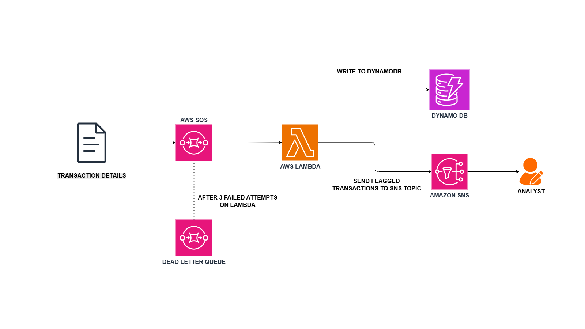

# Serverless Fraud Detection Pipeline on AWS

**Real-time transaction screening built to PCI DSS standards. Full cost transparency included.**

---

## What This Is

A production-grade, event-driven transaction screening pipeline modeled on the suspicious activity routing pattern used in financial institutions.

Most fraud detection demos process a transaction and fire an alert. This one does what regulated environments actually require:

- Every transaction — flagged or clean — written to an audit-ready DynamoDB table before any flag logic runs
- Dead Letter Queue capturing every message Lambda fails after 3 attempts. Nothing silently dropped
- Configurable screening threshold pulled from environment variables. Compliance teams adjust without a code deployment
- All AWS API traffic (SQS, DynamoDB, SNS, CloudWatch) routed through VPC endpoints. Zero public internet exposure
- PCI DSS Requirement 1.3 compliant network architecture with documented cost evidence

---

## Architecture




Lambda runs inside a VPC across two Availability Zones. All connections to SQS, DynamoDB, SNS, and CloudWatch use VPC Interface and Gateway endpoints.

---

## Key Engineering Decisions

### DynamoDB write happens before the flag check

The audit trail is the primary record. An unflagged transaction is not proof of a clean one. The record must exist regardless of outcome. This ordering matches how financial institutions handle transaction logging.

### Screening threshold is environment-variable-driven
```python
THRESHOLD = float(os.environ.get("FRAUD_THRESHOLD", "10000"))
```

Compliance teams adjust screening sensitivity without a code change or deployment cycle. The threshold is auditable via CloudTrail.

### Python `Decimal` instead of `float` for monetary values

DynamoDB rejects Python `float` types. Beyond the rejection, `float` produces silent precision errors on large financial amounts.
```python
from decimal import Decimal
amount = Decimal(str(record["amount"]))
```

### Dead Letter Queue after 3 failed processing attempts

Without a DLQ, a single poison-pill message blocks queue consumption indefinitely. The DLQ captures the failure for investigation rather than silently discarding it.

---

## Cost Breakdown

> AWS Pricing Calculator, March 2026, us-east-1. 500,000 transactions/month.

| Configuration | Monthly Cost | Notes |
|---|---|---|
| Base (no VPC endpoints) | $2.48 | Lambda + SQS + DynamoDB + SNS |
| PCI DSS compliant | $31.69 | Adds VPC Interface endpoints for SQS, SNS + Gateway endpoint for DynamoDB |
| **Delta** | **+$29.21** | PrivateLink = ~92% of the compliant bill |

PCI DSS Requirement 1.3 mandates private connectivity for cardholder data environments. VPC Interface endpoints for SQS and SNS cost $0.01/hour per endpoint per AZ. Across two AZs, two Interface endpoints = $29.20/month on top of a $2.48 base stack.

---

## PCI DSS Compliance Notes

| Requirement | Control | Implementation |
|---|---|---|
| Req 1.3 | Network isolation for cardholder data | VPC endpoints: SQS + SNS (Interface), DynamoDB (Gateway) |
| Req 3.5.1 | Encryption with customer-controlled key | SSE-KMS on DynamoDB. AWS-Owned Keys produce no CloudTrail evidence |
| Req 10 | Audit log of all data access | CloudTrail on every Lambda invocation and DynamoDB operation |

**AWS-Owned Keys fail PCI DSS Req 3.5.1.** CloudTrail does not log their usage. You cannot produce key access evidence for an auditor. Customer-managed KMS keys generate a CloudTrail entry on every encrypt and decrypt — that is the audit trail.


---

## Stack

| Layer | Service |
|---|---|
| Message ingestion | Amazon SQS |
| Processing | AWS Lambda (Python) |
| Storage | Amazon DynamoDB (SSE-KMS, on-demand) |
| Alerting | Amazon SNS |
| Failure handling | SQS Dead Letter Queue |
| Network isolation | VPC Interface + Gateway endpoints |
| Audit logging | AWS CloudTrail |
| Monitoring | Amazon CloudWatch |
| Encryption | AWS KMS (customer-managed) |

---


## Contact

**Victor Ogechukwu Ojeje** — Cloud Engineer | DevOps Engineer

Open to remote Cloud, DevOps, and SRE roles with infrastructure security depth.

*LinkedIn: [linkedin.com/in/victorojeje](linkedin.com/in/victorojeje) | GitHub: [github.com/escanut](github.com/escanut)
Blog: [dev.to/escanut](dev.to/escanut)*
```

